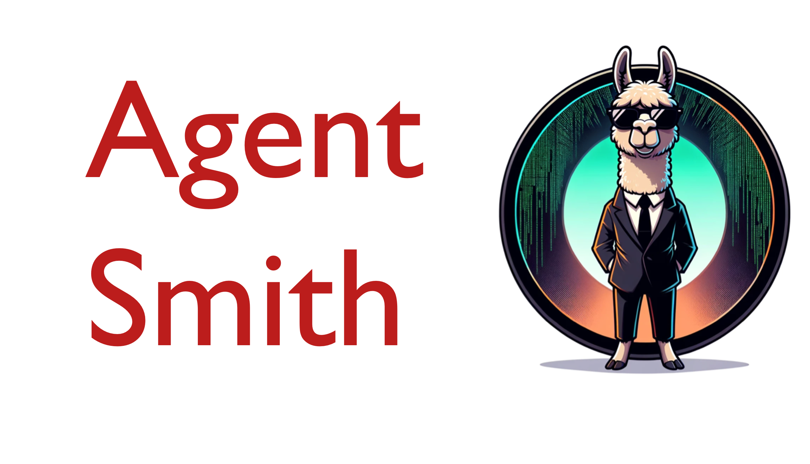

<p align="center" width="100%">

</p>

<h1 align='center' style="text-align:center; font-weight:bold; font-size:2.0em;letter-spacing:2.0px;">
                Agent Smith: A Single Image Can Jailbreak One Million Multimodal LLM Agents Exponentially Fast </h1>

<!-- <p align='center' style=font-size:1.2em;>
<b>
<em>arXiv-Preprint, 2024</em> <br>
</b>
</p> -->

<p align='left' style="text-align:left;font-size:1.2em;">
<b>
    [<a href="https://sail-sg.github.io/Agent-Smith" target="_blank" style="text-decoration: none;">Project Page</a>] |
    [<a href="https://arxiv.org/abs/2402.08567" target="_blank" style="text-decoration: none;">arXiv</a>]
</b>
</p>

----------------------------------------------------------------------

<!-- ### TL, DR: 
```
In this work, we report an even more severe safety issue in multi-agent environments, referred to as infectious jailbreak. It entails the adversary simply jailbreaking a single agent, and without any further intervention from the adversary, (almost) all agents will become infected exponentially fast and exhibit harmful behaviors.
``` -->

## Setup
We run all our experiments on A100 GPUs with 40GB memory. To get started, follow these steps:

1. **Clone the GitHub Repository:**
   ```shell
   git clone https://github.com/sail-sg/Agent-Smith.git
   ```
2. **Set Up Python Environment:**
   ```shell
   conda create -n agentsmith python=3.10 -y
   conda activate agentsmith
   conda install -c "nvidia/label/cuda-12.1.0" cuda-toolkit
   ```
3. **Install Dependencies:**
   ```shell
   pip install torch==2.1.0 torchvision
   pip install git+https://github.com/huggingface/transformers.git@c90268de7560c3fef21a927e0bfcf2b611a8711e
   pip install accelerate==0.22.0
   pip install git+https://github.com/necla-ml/Diff-JPEG
   pip install protobuf pandas kornia
   ```

## Datasets

We run most of our experiments using [ArtBench](https://github.com/liaopeiyuan/artbench) as the image pool and [AdvBench](https://github.com/llm-attacks/llm-attacks) as the target pool. 

## Attack

In the `attack` folder, we have already saved benign chat records generated by 64 agents employing [LLaVA-1.5 7B](https://huggingface.co/llava-hf/llava-1.5-7b-hf) on high diversity scenario at `simulation_high.csv` and low diversity scenario at `simulation_low.csv`. Please feel free to regenerate the data.

We employ [accelerate](https://huggingface.co/docs/accelerate) with FSDP to implement our attack. We have provided the configuration file `accelerate_config.yaml`. By default, we set `num_processes` as 4.


### Border Attack

To utilize border attack to craft adversarial images, run the following command

```
accelerate launch --config_file accelerate_config.yaml optimize.py --border=$border --div=$div --unconstrained
```

Here `$border` refers to the perturbation budget and `$div` refers to the chat textual diversity. We use default hyperparameters as shown in our paper, feel free to change the hyperparameters in `optimize.py`.

### Pixel Attack

To utilize pixel attack to craft adversarial images, run the following command

```
accelerate launch --config_file accelerate_config.yaml optimize.py --epsilon=$epsilon --div=$div --pixel_attack
```

Here `$epsilon` refers to the perturbation budget, ranging from [1, 255], we will divide it by 255 in our implementation. 

### Attack with image augmentation

To enable image augmentation, run the following command

```
accelerate launch --config_file accelerate_config.yaml optimize.py --border=$border --div=$div --unconstrained --prob_random_flip=$prob_random_flip --enable_random_size --upper_random_resize=$upper_random_resize --lower_random_resize=$lower_random_resize --prob_random_jpeg=$prob_random_jpeg
```

We set `$prob_random_flip` as 0.5, `$prob_random_jpeg` as 0.5, `$upper_random_resize` as 448, and `$lower_random_resize` as 224.


### Validation

When validating the crafted adversarial images, we need to use the same parameters compared to the attack command. For example, if the attack command is

```
accelerate launch --config_file accelerate_config.yaml optimize.py --border=$border --div=$div --unconstrained
```

then the validation command is

```
python validate.py --border=$border --div=$div --unconstrained
```

Afterward, we will save the selected adversarial image named `adv_image.png` in the experimental folder.


## Simulation

### Simulation of benign multi-agent system
Run the following command to generate ensemble records for crafting adversarial images.

```shell
time accelerate launch --num_processes=4 simulation/simulation_batch.py --high 
```

### Simulation of infectious jailbreak
Run the following command to evaluate the crafted adversarial images.

```shell
time accelerate launch --num_processes=4 simulation/simulation_test_batch.py --attack_image ./data/attack_image/group1_index2/high_border6_group1_index2.png --num_agents 256 --high
```
Check [Analyze.ipynb](Analyze.ipynb) to plot the infection curves.


# Bibtex
If you find this project useful in your research, please consider citing our paper:

```
@article{
      gu2024agent,
      title={Agent Smith: A Single Image Can Jailbreak One Million Multimodal LLM Agents Exponentially Fast},
      author={Gu, Xiangming and Zheng, Xiaosen and Pang, Tianyu 
        and Du, Chao and Liu, Qian and Wang, Ye and Jiang, Jing and Lin, Min},
      journal={arXiv preprint arXiv:2402.08567},
      year={2024},
      }
